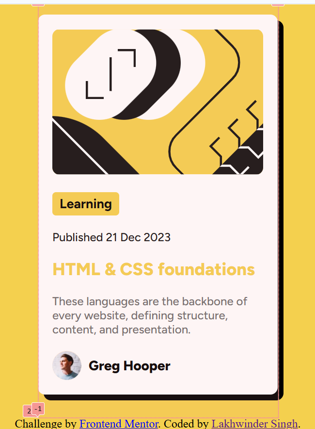
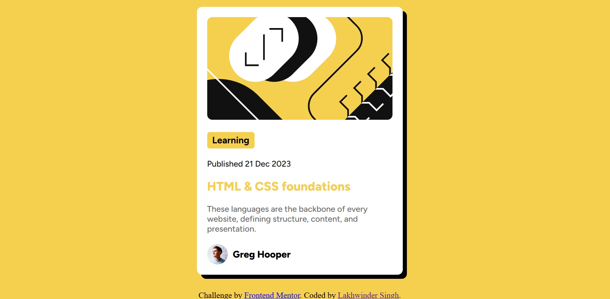

# Frontend Mentor - Blog preview card solution

This is a solution to the [Blog preview card challenge on Frontend Mentor](https://www.frontendmentor.io/challenges/blog-preview-card-ckPaj01IcS). Frontend Mentor challenges help you improve your coding skills by building realistic projects. 

## Table of contents

- [Overview](#overview)
  - [The challenge](#the-challenge)
  - [Screenshot](#screenshot)
  - [Links](#links)
- [My process](#my-process)
  - [Built with](#built-with)
  - [What I learned](#what-i-learned)
  - [Continued development](#continued-development)
- [Author](#author)

## Overview

### The challenge

Users should be able to:

- See hover and focus states for all interactive elements on the page

### Screenshot



### Links

- Solution URL: [Add solution URL here](https://your-solution-url.com)
- Live Site URL: [Add live site URL here](https://your-live-site-url.com)

## My process
- Broke down the visual component into a nodes and worked on individual node.
- Each node has specific styling. I got that covered in CSS.

### Built with

- Semantic HTML5 markup
- CSS custom properties
- Flexbox
- CSS Grid
- Mobile-first workflow

### What I learned

- Using grid and ```place-items: center;``` to place everything inside the node to center;
- ``` object fit``` requires some height and width to work on the img.
- ```@media (min-width:500px){css here}``` - that is how we set media queries.
- Inline elements ignore top and bottom margin. To solve this turn that element to inline block.
- To apply box shadow: ```box-shadow: x-offset y-offset blur spread color;```
- To apply hover state on the parent and the effect on the children, use this: 
 ```#card:hover h2{css here}```. This will trigger changes in the h2 element on hovering over the card.
- Using emmet abbreviations to fasten up the dev process. Some examples are below. You can visit [here](https://docs.emmet.io/abbreviations/syntax/) to see more abbreviations.

```html
//#card>h1+p will result in 
<div id = "card">
<h1></h1>
<p></p>
</div>
//#card>.text>p^img will result in 
<div id = "card">
  <div class = "text">
    <p></p>
  </div>
  
</div>
```
```css
.proud-of-this-css {
   main{
        background-color: var(--yellow);
        height: 100vh;
        display: grid;
        place-items: center;
      }
}
```

### Continued development

- Need to learn more about flexbox axes.
- How to use grids in CSS? 

## Author

- Website - [Lakhwinder Singh](https://lakhwinder.netlify.app)
- Frontend Mentor - [@Lakhwinderr](https://www.frontendmentor.io/profile/Lakhwinderr)
- Twitter - [@LakhwinderCode](https://www.twitter.com/LakhwinderCode)


